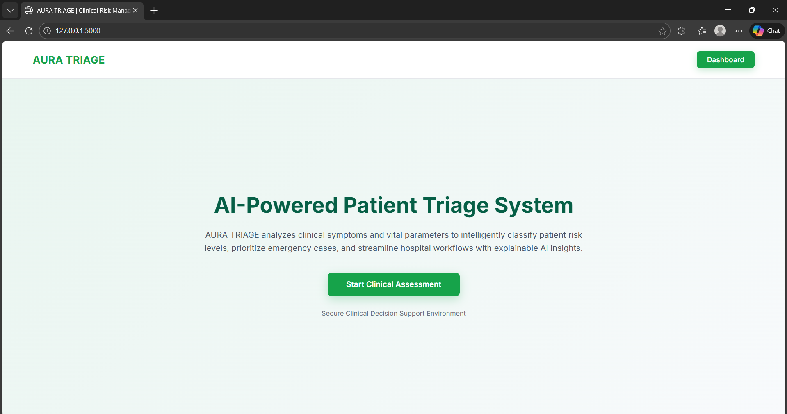
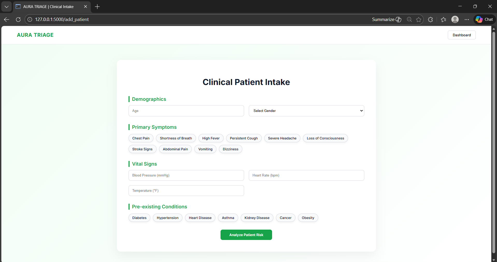
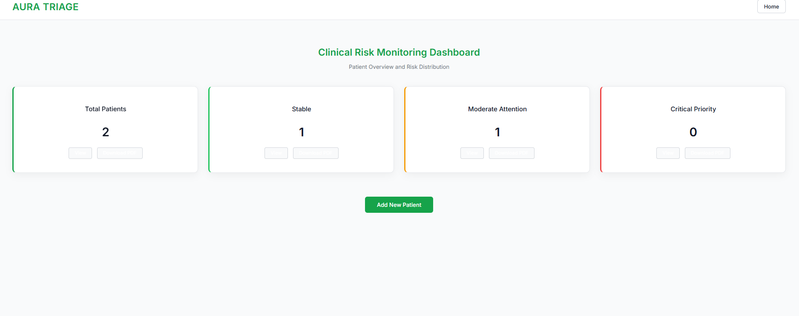
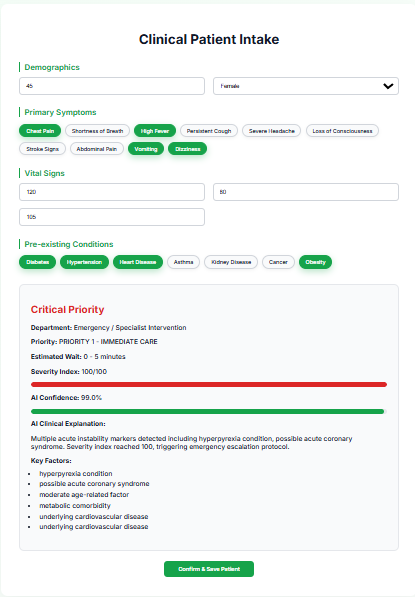

# AURA TRIAGE 🏥

AURA (Automated Urgency Risk Assessment) TRIAGE is an AI-powered patient triage system designed to evaluate clinical severity using vital parameters and risk scoring logic.

# AURA TRIAGE 🏥

AURA (Automated Urgency Risk Assessment) TRIAGE is an AI-powered patient triage system...

## 🔥 Features

- Severity Index Calculation
- Risk Classification (Green / Yellow / Red)
- Flask Backend
- SQLite Database
- PDF Report Generation
- Interactive Dashboard UI

## 🛠️ Tech Stack

- Frontend: HTML, CSS, JavaScript
- Backend: Python (Flask)
- Database: SQLite
- Reporting: ReportLab

## 🚀 How to Run

1. Clone the repository:
   git clone https://github.com/yourusername/AURA-TRIAGE.git

2. Install dependencies:
   pip install -r requirements.txt

3. Run the application:
   python app.py

4. Open browser:
   http://127.0.0.1:5000

## 📊 Severity Index Model

Patients are classified based on a risk scoring algorithm:
- Green → Stable
- Yellow → Moderate Risk
- Red → Critical

---

## 📸 Project Preview

### 🏠 Home Page

---

### 📝 Add Patient Form

---

### 📊 Dashboard

---

### 📄 PDF Report Preview

